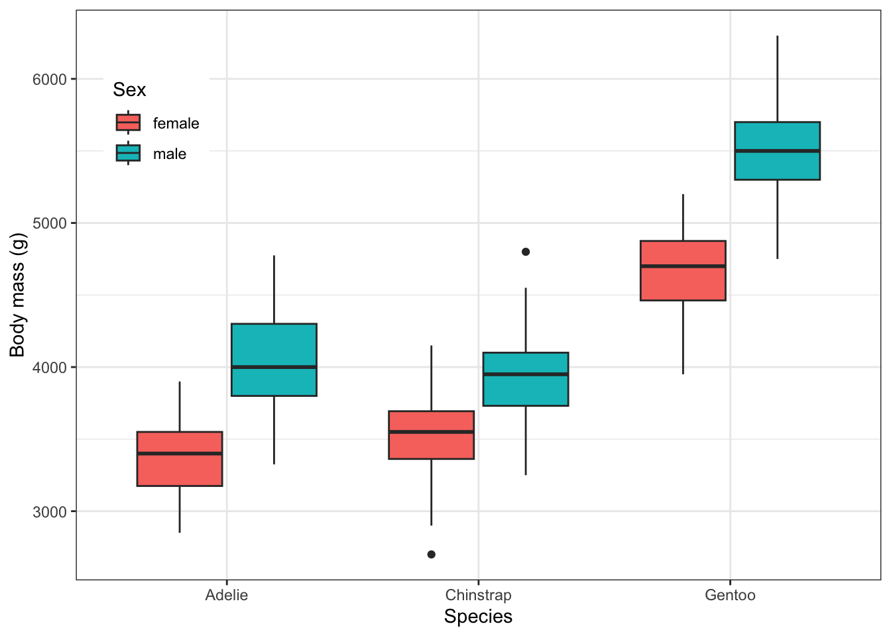
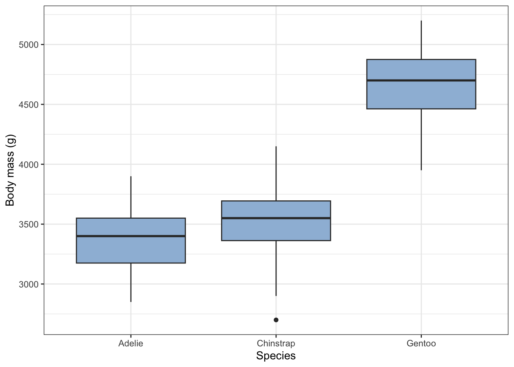
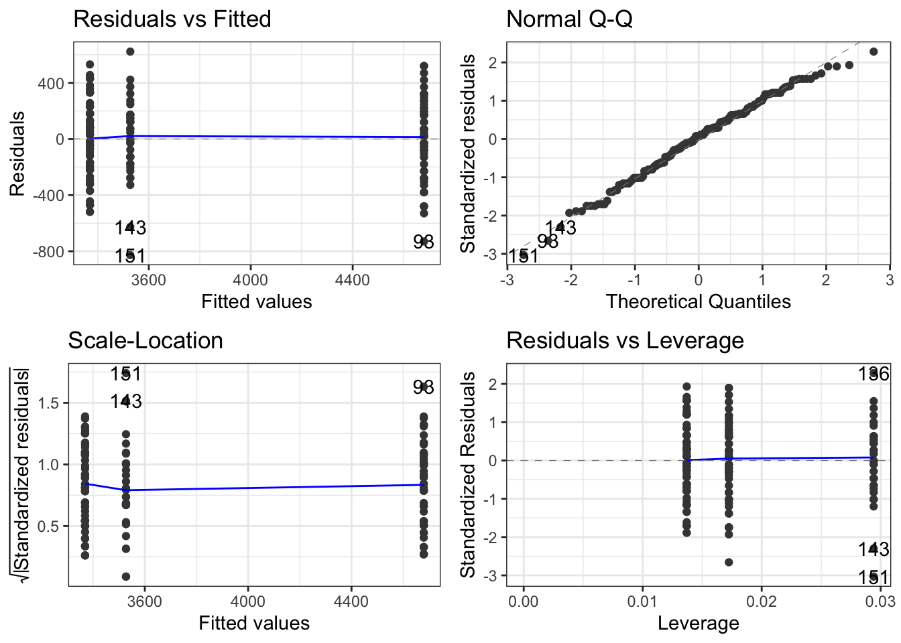

# One-way ANOVA

In this exercise we will carry out a method of analysis known as ANOVA - this is what is commonly used when you have one or more categorical variables, such as species, sex and so on, and a numerical response variable such as body mass and you want to know if there is a difference in the response variable between the categories.


### Load packages

```r
library(tidyverse) # for data manipulation and plots, and more besides
library(ggfortify) # this is useful for diagnostics
library(palmerpenguins) # for the palmer penguin data
```


The `palmerpenguins` package comes with two in-built data sets on penguins. The simplest of them is called `penguins` and is the one we will use in this exercise:


```r
glimpse(penguins)
```

```
## Rows: 344
## Columns: 8
## $ species           <fct> Adelie, Adelie, Adelie, Adelie, Adelie, Adelie, Adel…
## $ island            <fct> Torgersen, Torgersen, Torgersen, Torgersen, Torgerse…
## $ bill_length_mm    <dbl> 39.1, 39.5, 40.3, NA, 36.7, 39.3, 38.9, 39.2, 34.1, …
## $ bill_depth_mm     <dbl> 18.7, 17.4, 18.0, NA, 19.3, 20.6, 17.8, 19.6, 18.1, …
## $ flipper_length_mm <int> 181, 186, 195, NA, 193, 190, 181, 195, 193, 190, 186…
## $ body_mass_g       <int> 3750, 3800, 3250, NA, 3450, 3650, 3625, 4675, 3475, …
## $ sex               <fct> male, female, female, NA, female, male, female, male…
## $ year              <int> 2007, 2007, 2007, 2007, 2007, 2007, 2007, 2007, 2007…
```

### Remove observations with missing values

We can see from the first few values of the glimpse table that some rows have missing values (NAs). We need to decide what to do with them. Here we will simply remove them! Here is a way to remove any row that contains missing values in one column or another:


```r
penguins_clean <- penguins |>
  drop_na()
glimpse(penguins_clean)
```

```
## Rows: 333
## Columns: 8
## $ species           <fct> Adelie, Adelie, Adelie, Adelie, Adelie, Adelie, Adel…
## $ island            <fct> Torgersen, Torgersen, Torgersen, Torgersen, Torgerse…
## $ bill_length_mm    <dbl> 39.1, 39.5, 40.3, 36.7, 39.3, 38.9, 39.2, 41.1, 38.6…
## $ bill_depth_mm     <dbl> 18.7, 17.4, 18.0, 19.3, 20.6, 17.8, 19.6, 17.6, 21.2…
## $ flipper_length_mm <int> 181, 186, 195, 193, 190, 181, 195, 182, 191, 198, 18…
## $ body_mass_g       <int> 3750, 3800, 3250, 3450, 3650, 3625, 4675, 3200, 3800…
## $ sex               <fct> male, female, female, female, male, female, male, fe…
## $ year              <int> 2007, 2007, 2007, 2007, 2007, 2007, 2007, 2007, 2007…
```
That has removed 11 rows of data, so we haven't lost too much information.

### Summary - group by species and sex

Here we use the famliar `group_by()` and `summarise()` construction to find the mean body mass for each combination of species and sex. We also calculate the standard error of those means and the number of individuals in each group.


```r
penguins_clean |>
  group_by(species, sex) |>
  summarise(n = n(), mean_bm = mean(body_mass_g), se_bm = sd(body_mass_g)/sqrt(n()) ) |>
  ungroup()
```

```
## # A tibble: 6 × 5
##   species   sex        n mean_bm se_bm
##   <fct>     <fct>  <int>   <dbl> <dbl>
## 1 Adelie    female    73   3369.  31.5
## 2 Adelie    male      73   4043.  40.6
## 3 Chinstrap female    34   3527.  48.9
## 4 Chinstrap male      34   3939.  62.1
## 5 Gentoo    female    58   4680.  37.0
## 6 Gentoo    male      61   5485.  40.1
```

Looking at this table, does it look as though females and males have different weights? If so, which is heavier? Is this true for all species? Do the different species weigh the same?


### Plot the data

To get further insight into these questions, we can plot the data. Here we will do a box plot


```r
penguins_clean  |>
  ggplot(aes(x=species, y = body_mass_g, fill = sex)) +
  geom_boxplot() +
  labs(x = "Species",
       y = "Body mass (g)",
       fill = "Sex") +
  scale_colour_brewer(palette = "Set1") +
  theme_bw() +
  theme(legend.position= c(0.1,0.8))
```



What do you think now about size differences between species and the two sexes?

There is a lot going on here, so let's approach this more simply to begin with and concentrate solely on the difference between the females of the species.

### One-way ANOVA

Let's ask the question: do the body weights differ between females of the different species?

There is just one **factor** here, species, and it has more than two **levels** - the three different species - and the reponse variable is numeric, so it is highly likely that the appropriate test to answer this question is a one-way ANOVA. 'One way' because there is one factor, and 'ANOVA' (instead of t-test) because there are more than two levels.

#### Null hypothesis
Pretty much all of the commonly used statistics tests are asking the question: what is the probability that you would have got this data, or more extreme data, if the null hypothesis were true? Their job is to calculate that probability, which is called a p-value. There is a lot more besides, but what this means is that in carrying out any of these tests we at least need to have a hypothesis in mind and its corresponding null hypothesis. The null, remember, is typically the 'nothing going on', there is no effect, no difference scenario.

So in this case, a suitable null hypothesis would be that there is no difference in body mass between the females of the different penguin species. 

To see if there is evidence from the data to reject this null, we will follow a sequence of steps that will be common to many analyses:

* get the data
* clean/prepare the data
* summarise the data
* plot the data
* construct the model using whatever test is appropriate, in this case a one-way ANOVA
* check whether the model is valid
* inspect the model output
* reject or fail to reject the null hypothesis
* if we reject the null, carry out post-hoc tests
* (maybe) simplify the model and redo the analysis


For the penguin data, getting it was easy as it came with the `palmerpenguins` package.

To prepare the data, we start with the full data set and narrow it down to just the females, using the `filter()` function, and again make sure there are no lines with missing values, using `drop_na()`. We save this cleaned data set in an object called `females`.


```r
females <- penguins |>
  filter(sex == "female") |>
  drop_na()
```

Then let's summarise these values to find the number of individuals, the mean body mass for each species, and the standard errors of those means:


```r
females |>
  group_by(species) |>
  summarise(n = n(), mean.mass_f = mean(body_mass_g), se.mass_f = sd(body_mass_g)/sqrt(n()))
```

```
## # A tibble: 3 × 4
##   species       n mean.mass_f se.mass_f
##   <fct>     <int>       <dbl>     <dbl>
## 1 Adelie       73       3369.      31.5
## 2 Chinstrap    34       3527.      48.9
## 3 Gentoo       58       4680.      37.0
```
We should inspect this summary table and see what we already think about whether the null hypothesis is likely to be rejected, or not.

Now let's plot them, using a box plot (but choose your favourite plot type):


```r
females  |>
  ggplot(aes(x=species, y = body_mass_g)) +
  geom_boxplot(fill = "#9ebcda") +  # pick your favourise colour from https://colorbrewer2.org/
  labs(x = "Species",
       y = "Body mass (g)") +
  theme_bw()
```



From the summary table and the plot, what do you think? Do the masses differ between the species? 


#### The actual ANOVA

You probably have a good idea what the answer is, as to our question, but now we will move on to the actual statistics test, in this case a one-way ANOVA.

An ANOVA is one variant of a range of anlysis techniques known as 'linear models'. If you were to look under the hood, you would see that mathematics behind it is exactly the same as that behind linear regression, which we use when we have a continuous explanatory variable and where we fit straight lines onto a scatter plot. Thus it is no surprise that the ANOVA is carried out in R in exactly the same way as linear regression would be:

First, we use the `lm()` function to construct a linear model of the data:

#### Construct the model

```r
females.model <- lm(body_mass_g ~ species, data = females)
```

Here the `lm()` function has done all the maths of the ANOVA, and we have saved the results of that in an object called `females.model`. Note the use of the formula `body_mass_g ~ species` as the first argument of the `lm()` function, where this means 'body mass as a function of species'.


#### Is the model valid?
All linear models are only valid if the data meet a number of criteria. Chief among these for an ANOVA is that the spread of the data should be roughly the same in each subset, and that the data within each subset should be normally distributed around their respective mean values. Only if there conditions are met can be just go on and trust the output of the model. If they are not, we need to transform the data in some way until they are, or use a different test.

There are various ways we can find out whether these consitions are met. A useful one is to do it graphically, and a useful way to do that is to use the `autoplot()` function from the `ggfortify` package. Let's do it:


```r
autoplot(females.model) + theme_bw()
```



All four graphs presented here tell us something about the validity or not of our model. Here we will just focus on the upper two:

* top-left: this shows the spread of the residual masses (diference between an individual's mass and the mean mass for its species) for each species. We see that the spread of these values is aout the same for all three species. Check!

* top-right: this is a qq-plot, or `quantile-quantile` plot. This compares the distribution of the residuals for each species with a normal distribution. If the residuals are normally distributed, we will get a straight line.  If not, we won't. To get an idea of what qq-plots can look like for data that definitely are not normally distriuted, see https://rpubs.com/mbh038/725314. Here, there is a hint of a curve, but this is really pretty good for a real data set. No such data is ever perfectly normally distrivuted, so the best we are looking for, in practice is something approximating a straight line, often with some raggedness at either end. So, check again!

On both counts, we are good to go: we can reasonably trust the output of the ANOVA.

So what is this output? We find this in three steps

#### The overall picture

First, we use the `anova()` function


```r
anova(females.model)
```

```
## Analysis of Variance Table
## 
## Response: body_mass_g
##            Df   Sum Sq  Mean Sq F value    Pr(>F)    
## species     2 60350016 30175008  393.25 < 2.2e-16 ***
## Residuals 162 12430757    76733                      
## ---
## Signif. codes:  0 '***' 0.001 '**' 0.01 '*' 0.05 '.' 0.1 ' ' 1
```
This gives us an overvierw of all the data and asks the question: how likely is it that you would have got your data if species made no difference to body mass. There are three things to note:

* the test statistic, here called an F-value. This is a number calculated from the data. If the validity criteria for the test have been met by the data, then this has a known distribution. The bigger it is, the more likely it is that the null will be rejected.

* the `degrees of freedom`, here denoted as Df and listed in the first column. These are the numer of independent pieces of information in the data, which here means, how many species and how many penguins. 

* the p-value,  which is the probability of getting an F value as big as or bigger than the one actually found, if the null hypothesis were true. This is is the number listed at the right as Pr(>F).

The F value here is huge and the p-value is tiny, so tiny that it is esentially zero. Thus we can confidently reject the null hypothesis and assert that there is evidence from the data that body mass of females differs between at least one pair of species. Which two, or between all of them, and by how much we don't yet know. This first step just tells us whether there is some difference somewhere. If there were no evidence of any difference we would stop the analysis right here.

But there is a differnce in this case, so we continue

#### The detailed picture

We use the `summary()` function for this:


```r
summary(females.model)
```

```
## 
## Call:
## lm(formula = body_mass_g ~ species, data = females)
## 
## Residuals:
##     Min      1Q  Median      3Q     Max 
## -827.21 -193.84   20.26  181.16  622.79 
## 
## Coefficients:
##                  Estimate Std. Error t value Pr(>|t|)    
## (Intercept)       3368.84      32.42 103.908  < 2e-16 ***
## speciesChinstrap   158.37      57.52   2.754  0.00657 ** 
## speciesGentoo     1310.91      48.72  26.904  < 2e-16 ***
## ---
## Signif. codes:  0 '***' 0.001 '**' 0.01 '*' 0.05 '.' 0.1 ' ' 1
## 
## Residual standard error: 277 on 162 degrees of freedom
## Multiple R-squared:  0.8292,	Adjusted R-squared:  0.8271 
## F-statistic: 393.2 on 2 and 162 DF,  p-value: < 2.2e-16
```
The is a lot in ths output, so let's just consider the coefficient table, to begin with. Focus first on the top left value, in the Estimate column. This tells us the mean body mass of the reference or 'Intercept' species. In this case that is 'Adelie', purely because 'Adelie' comes alphabetically before the other two species names, 'Chinstrap' and 'Gentoo'. By default, R will always order levels of a factor alpabetically. This is often a nuisance, and we have to tell R to reorder the levels the way we want them, but here it is OK.

So, the mean mass of female Adelie penguins in our sample is 3368 g. Cross ceck that with your initial summary table and the box plot. What about the other two species? Here's the thing: for all rows except the first in the Estimate column we are not given the absolute value but the difference between their respective mean values and the reference mean in the first, 'Intercept' row.

Thus, we are being told that Chinstrap females in the sample have a mean body mass that is 158.37 g heavier than that of Adelie females, so that their mean body mass is 3368.84 + 158.37 = 3527.27g. Again, cross chck that with your summary table and the box plot. Is it right?

What about Gentoo females? Were they heavier than Adelie penguins, and if so, by how much? What was their mean body mass.

Why doesn't `summary()` just tell us the actual body masses instead for all three species instead of doing it in this round about way? The reason is that ANOVA is concerned with detecing evidence of *difference*. This we are being told what the differences are between each of the levels and one reference level, which here is Adelie.

Are those differenes signifcant? We use the right hand p-value column for that. Look in the rows for Chinstrap and Gentoo penguins. In both cases the p values are much less than 0.05. This is telling us that in both cases there is evidence that females of these species are significantly heavier than those of the Adelie species. 

Note that we have only been told, so far, about the magnitude and significance of differences between all the levels and the reference level. We are not told the significance of of any difference between any other pair of levels. So in particular, the ANOVA does not tell us whether there is a significant difference between the masses of Chinstrap and Gentoo females (although we may have a good idea what the answer is, from our initial summary table and plot).

To find the answer to that, we o post-hoc tests:

#### Post hoc tsts.

A final step of most ANOVA analyses is to perform so-called post-hoc ('after the fact') tests which make pairwise comparisons between all possible pairs of levels, tell us what the differences are between those pairs and whether the differences are significant. Whatever method is used for this, it needs to take account of the danger of making Type-one errors that arises when multiple pair-wise tests are done.

A commonly used function for doing this is Tukey's Honest Signficant Difference: `TukeyHSD()`


```r
TukeyHSD(aov(body_mass_g ~ species, data = females))
```

```
##   Tukey multiple comparisons of means
##     95% family-wise confidence level
## 
## Fit: aov(formula = body_mass_g ~ species, data = females)
## 
## $species
##                       diff        lwr       upr     p adj
## Chinstrap-Adelie  158.3703   22.32078  294.4197 0.0179471
## Gentoo-Adelie    1310.9058 1195.64908 1426.1624 0.0000000
## Gentoo-Chinstrap 1152.5355 1011.00620 1294.0648 0.0000000
```
In each row of the output we see the difference between the mean masses of the females of two species, where a positive value tells us that the first named species has the heavier mass. So, we see that Gentoo females in the sample were on average 1310.9 g heavier than Adelie females.

Compare these differences with your initial summary table and your box plot. Do they agree? They should!

The right-hand column  'p adj' tells us whtehr these difference are significant. If the p values are less than 0.05 then they are, at the 5% significance level. In this case they all are. The p values are so tiny for the differences between Gentoo and the other two species that that they are reported as zero.


### Reporting the Result.

We try to use plain English to report our results, while still telling the reader what test was used and the key outputs of the test. Try to report the name of the test, the test statistic, the degrees of freedom, and the p-value. if. the p-value is really small then it is common to report it as p<0.01, or p<0.001. No one cares if it is a billionth or a squillionth. t just matters that is t is *really* small, if that is the case. If it is onlt just below 0.05, then I would report it isn full, so we might write p = 0.018. If p > 0.05 then conventiallly it is not reported, except to say p > 0.05.

In this case, we might say something like:

*We find evidence that there is a difference between the body masses of females of the penguon species Adelie, Chinstrap and Gentoo (ANOVA, df = 2, 162, F = 393, p < 0.001). In particular Gentoo are more than 1kg heavier than the other two (p< 0.001) while the difference between Chinstrap and Adelie is smaller, at 158g, but still significant (p = 0.018).*


